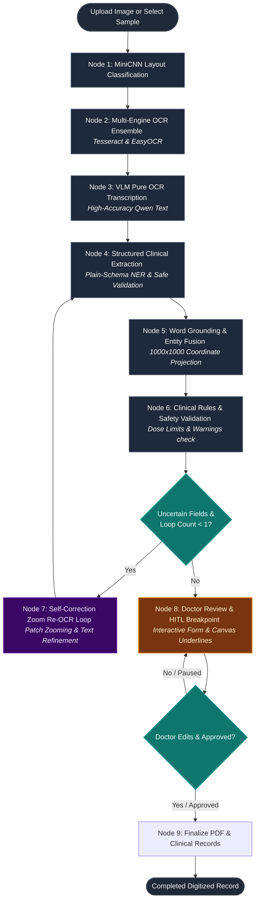

# MediDigitizer AI 2.0 - System Architecture & Pipeline Flowchart

This document details the system architecture and stateful processing flowchart of the LangGraph-powered **MediDigitizer AI 2.0** application.

---

## 1. High-Level Architecture

The application is structured into a stateful, modular pipeline utilizing local classification, hybrid multi-engine OCR, remote vision-language processing via a job queue, and safety-guided clinical entity extraction:

```
[ Frontend: Interactive Canvas + Review Drawer ]
                      │   ▲
                      ▼   │  JSON State Events
          [ Backend: FastAPI App Controller ]
                      │   ▲
                      ▼   │  Invoke / Resume
             [ LangGraph State Machine ]
              ├── Local MiniCNN (PyTorch)
              ├── Local Tesseract & EasyOCR
              └── Remote Colab GPU (via Ngrok Tunnel)
                     ├── Qwen2.5-VL (OCR & Word Grounding)
                     └── frob/unlimited-ocr (Fine-tuned Transcription)
```

---

## 2. Step-by-Step Processing Flowchart

Below is the stateful execution flow managed by the **LangGraph** orchestration engine. The machine executes nodes sequentially, supports self-correcting loops for low-confidence data, and holds a state breakpoint for manual review:



---

## 3. Core Pipeline Components

### Node 1: MiniCNN Layout Classification
* **Input**: Native image array (`OpenCV`).
* **Processing**: Performs sliding-window patch segmentation and feeds regions into `mini_cnn_model.pth`.
* **Output**: Classifies boxes into **Handwritten**, **Printed**, or **Mixed** text blocks to direct OCR strategies.

### Node 2: Multi-Engine OCR Ensemble
* **Input**: Image paths.
* **Processing**: Executes Tesseract LSTM and EasyOCR locally in parallel.
* **Output**: Generates initial raw line and word bounding boxes.

### Node 3: VLM Pure OCR Transcription
* **Input**: Prescription scan.
* **Processing**: Sends image + transcription request to remote Qwen2.5-VL via Colab Ngrok queue.
* **Output**: Returns accurate text transcription without coordinate hallucination.

### Node 4: Structured Clinical Extraction
* **Input**: Combined OCR text.
* **Processing**: Extracts information using the expanded prescription JSON schema.
* **Output**: Safely parses Patient name, Doctor details, Date, and a list of Medications into structured fields.

### Node 5: Word Grounding & Entity Fusion
* **Input**: Original image + Node 3 OCR text.
* **Processing**: Normalizes image to $1000 \times 1000$ and asks Qwen for raw `[xmin, ymin, xmax, ymax]` word locations. Projects coordinates back to native image dimensions.
* **Output**: Links extracted NER entities (e.g. Drug names) to coordinates, generating highlights and underlines.

### Node 6 & 7: Validation & Self-Correction
* **Processing**: Evaluates extraction confidence. If crucial numbers are low-contrast or illegible, Node 7 crops the image box, runs a local high-contrast zoom pass, and merges refined characters back into the main transcription.

### Node 8: Human-in-the-Loop Review
* **Processing**: Pauses the LangGraph machine state. Serves findings to the interactive front-end. Doctors can review overlays on the document canvas, edit any field, and click **Approve & Finalize** to resume the workflow.
